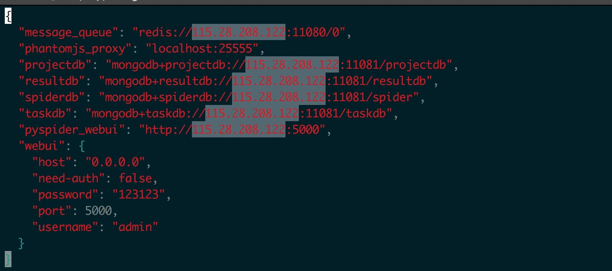

# 爬虫安装部署

维护人：陈牵

更新时间：2017-09-29

## basin-spider 安装部署

basin-spider 基于pyspider 爬虫为基础,由之前每个爬虫一个project方式,改造成任务方式.能够方便增删改任务,同时不影响之前爬虫工程代码.

basin-spider使用docker 部署,依赖3个组件.
1. pyspider: pyspider爬虫组件
2. mongodb: 存储采集数据和任务
3. redis: 存储采集消息队列

basin-spdier和pyspider docker镜像发布与115.28.208.122上.

### 部署步骤:

1. 下载docker-compose.yml 和配置文件
地址: http://115.28.208.122:88/basin-spider/basin-spider-toolkit.tar.gz

2. 解压进入basin-spider目录,修改配置
    修改ip地址,如下所示,如果是本机运行.可以修改127.0.0.1
    
3. 执行启动爬虫服务,默认启动 redis, mongo, pyspider, basin-spider

    ~~~
    docker-compose up -d
    ~~~
4. 导入spider app工程,当前支持4个招标网站采集app,(南网,国网,政府招标,安徽招标)

    ~~~
    !!需要指定目标 mongodb 地址和port
     docker run --rm \
                -v ${PWD}/db/spider/spider:/tmp/db/spider/spider \
                mongo:3.0.15 \
                mongorestore --host 115.28.208.122 --port 11081 --db spider /tmp/db/spider/spider
    ~~~

5. 安装spidercli 命令

    ~~~
    cd spidercli
    pip install -r requirements.txt
    python setup.py install
    ~~~

6. 爬虫服务管理控制,可以使用spidercli命令行工具或者直接调用api 接口,相关连接
  
  + [spider_cli](./spider_cli.md)
  + [spider_api_调用](./spider_api_invoke.md)

6. 查看采集状态
    由于未做basin-spider监控界面,当前还是使用spider自带的监控.
    http://115.28.208.122:5000

## 采集服务测试地址

当前采集服务器地址:
+ 接口地址:http://115.28.208.122:5001  
+ 监控地址(暂时):http://115.28.208.122:5000

