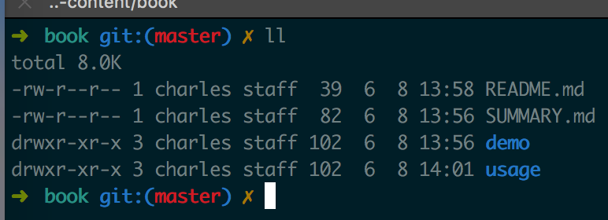

# 使用说明

gitbook服务架设在10.142.55.177(内网环境)

## 使用方式

1. 下载basin-content
~~~
git clone ssh://git@115.28.208.122:10022/basin/basin-gitbook.git
~~~

2. 以book目录作为根目录,在该目录下编辑内容

3. 增加修改内容,提交到gitlab后,再调用tools/remote_pull.sh,内网服务器从gitlab上同步最新修改内容

~~~
git add .
git commit -m 
git push origin master
sh tools/remote_pull.sh #或者内网服务器定时同步内容
~~~

## gitbook 使用说明
参考地址: https://tonydeng.github.io/gitbook-zh/gitbook-howtouse/index.html
